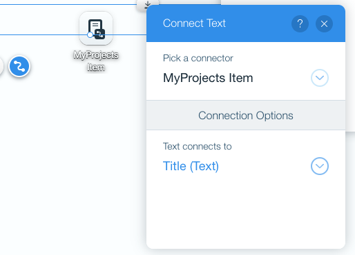

## Present the Project Details on a Page

In this module, we'll create a dynamic page to showcase a specific project's details.

**:bulb: New concepts**
- [Dynamic Pages](https://www.wix.com/corvid/feature/dynamic-pages): A Dynamic Page creates a page template that can be rendered for each item in your Database Collection. This enables you to write code one time that will execute to create content based off what is currently in your database collection.
- [Dataset](https://www.wix.com/corvid/new-reference/wix-dataset#top): Datasets allow you to control the size of the data and data permissions of a page when connecting to a Database Collection. It enables you to minimize the amount of data you are carrying on the UI and has easy built-in pagination.

**:white_check_mark: Step-by-Step Instructions**

1. Once your collection is created, we can create Dynamic Pages. Click the **gear icon** next to the collection. Then select **Add a Dynamic Page**.  

2. This will automatically create Dynamic Pages. You can tell the page is Dynamic instead of Static because the page icon will contain 3 pages instead of 1.  

3. To navigate to a dynamic page, Corvid automatically uses the Primary Key, which in our case is the title. You can tell what the routing structure for the dynamic page is based off what is the parentheses next to the dynamic page.

4. **Select the MyProjects (Title) Dynamic Page** so we can add UI elements to it.

5. You will have a blank template. Let's **add a couple components** to the page. We can use Wix UI components. Add at least:
- 1 Image component
- 2 Text components (Title and Paragraph text components would be good options)
- 1 Selection Tags component

> Make sure to give components descriptive IDs as it makes it easier to work with them in the code as you'll remember what their intended purpose is.

6. We can now connect Data to these components so they dynamically render with NO CODE(:exploding_head:). **Select a Title Text Component** on your page. **Click the Connect to Data** icon.

7. Dynamic Pages already have a Dynamic Dataset bound to them. **Connect to the Projects item** connector and **select Title** from the dropdown of _Text connects to..._ Connection Options. Now we've dynamically bound data to our UI components with no code!  

8. Feel free to add additional components and connect them to your other fields in your dataset.  

:fast_forward: Next Module => [Explore the App Market](APP_MARKET.md)
