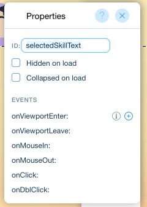
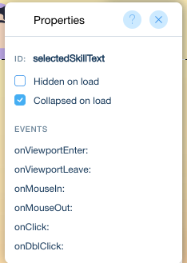

## Access page memory

In this module, we'll use Wix Storage API to access data stored in the user's browser.

**:bulb: New concepts**
- [Data Filters](https://www.wix.com/corvid/new-reference/wix-data/filter): Create a filter for data
- [Dataset Filters](https://www.wix.com/corvid/new-reference/wix-dataset/dataset/setfilter): Use a Wix Data filter to filter a page's dataset.


**:white_check_mark: Step-by-Step Instructions**

1. Let's switch over to the Project List page.

2. We want to show the Selected Skill for filtering, but also hide that field if nothing is selected. We can reuse a text field to accomplish this. **Select the _text1_ field and rename it in the properties pane to a more descriptive name.** <br>


3. Set this field to **Collapsed on load**. <br>


4. Based on if the memory is set, we can Collapse or Expand the new selectedSkillText field. You will need to **import Wix Storage** on this page.
```javascript
import { memory } from 'wix-storage';
```

5. Instead of setting the item in Storage, we can now get the item and see if it has a value. **Create a variable to retrieve the memory item using `getItem()`**. `getItem()` takes in a parameter of the item name that we set when we set the item.
```javascript
let selectedSkill = memory.getItem("skill");
```

6. We can use this value to determine if we should expand our `selectedSkillText`. **Create an `if()` statement to check the value.**
```javascript
if (selectedSkill) {

}
```

7. If `selectedSkill` is set, we want to set the text value of the `selectedSkillText` field to the value of the selected skill. Inside the true of the `if()` statement, **set the text property of _selectedSkillText_ to the value of the selected skill**.
```javascript
$w('#selectedSkillText').text = "Selected Skill: " + selectedSkill;
```

8. We'll now need to show that text field as well. Since it is collapsed, we want to expand it. Fields can also be show/hidden, but they still take up space on the UI when hidden. Show/Hide is helpful when overlapping other UI elements. For this field, we want it to take up space and be distinct, so we use collapse/expand.

9. **Expand the text element** once the text value is set.
```javascript
$w('#selectedSkillText').expand();
```

10. The last thing we need to do is actually filter the list of projects to only show the projects that use that skill or technology. This is helpful for recruiters because they only want to see projects relevant to the role they are hiring for. Too many projects will cause them to miss the ones that would highlight your skill set.

11. We want to create a new filter for the Projects dataset. We can use the Wix Data API to create a filter, and then the Wix Dataset `setFilter()` method to apply it to the dataset. So to get started, we need to **import the Wix Data API**.
```javascript
import wixData from 'wix-data';
```

12. With the Wix Data API, we can create a filter on different fields in the database. In this case, we want to see if the Technology Used tags field contains the selected skill in the memory. Inside our `if()` statement, let's **create a Wix Data filter to see if _technologyUsed_ contains the _selectedSkill_**.
```javascript
let skillFilter = wixData.filter()
							.contains("technologyUsed", selectedSkill);
```

13. We can **apply this filter to the Projects dataset using the Dataset `setFilter()` method**.
```javascript
$w('#projectsDataset').setFilter( skillFilter);
```

14. The `setFilter()` method returns a promise. To verify the filter is successfully applied, we can **console log a Done message in the successful return of the promise**.
```javascript
$w('#projectsDataset').setFilter( skillFilter)
  .then(() => {
	   console.log("DONE")
	});
```

15. Our `if()` statement should look something like this:
```javascript
let selectedSkill = memory.getItem("skill");
if (selectedSkill) {
	$w('#selectedSkillText').text = selectedSkill;
	$w('#selectedSkillText').expand();
  let skillFilter = wixData.filter()
    .contains("technologyUsed", selectedSkill);
	$w('#dataset1').setFilter(skillFilter)
	 .then(() => {
	    console.log("DONE")
	 });
}
```


:fast_forward: Next Module => [JavaScript Web Modules](JS_WEB_MODULES.md)
